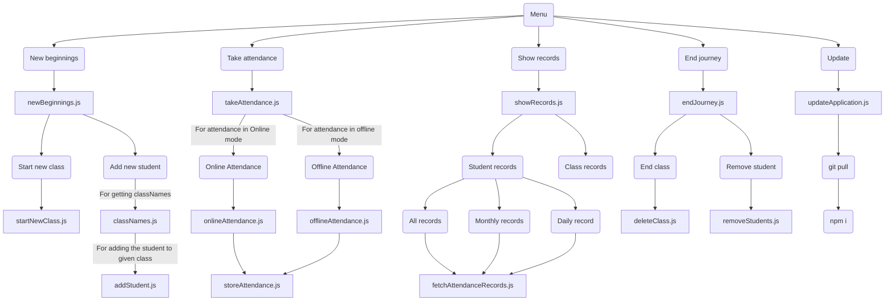

```mermaid
flowchart TB;

%% Creating menu items

menu(Menu) --> newBeg(New beginnings)
menu --> takAtt(Take attendance)
menu --> shRec(Show records)
menu --> endJrn(End journey)
menu --> upd(Update)

%% Putting up the file names for resp. menu items

newBeg --> newBegFil[newBeginnings.js]
takAtt --> takAttFil[takeAttendance.js]
shRec --> shRecFil[showRecords.js]
endJrn --> endJrnFil[endJourney.js]
upd --> updFil[updateApplication.js]

%% Menu items of New beginnings

newBegFil --> newBegOpt1(Start new class)
newBegFil --> newBegOpt2(Add new student)

%% Files for all menu items of new Beginnings

newBegOpt1 --> newBegOpt1Fil[startNewClass.js]
newBegOpt2 --> |For getting classNames|newBegOpt2File1[classNames.js]
newBegOpt2File1 --> |For adding the student to given class|newBegOpt2File2[addStudent.js]

%% Menu items for taking attendance

takAttFil --> |For attendance in Online mode|onlAtt(Online Attendance)
takAttFil --> |For attendance in offline mode|offAtt(Offline Attendance)

%% Files required for respective menu items of modes of attendance

onlAtt --> onlAttFil[onlineAttendance.js]
offAtt --> offAttFile[offlineAttendance.js]

onlAttFil --> strAtt[storeAttendance.js]
offAttFile --> strAtt

%% Working on showRecords menu items

shRecFil --> stuRec(Student records)
shRecFil --> classRec(Class records)

%% Working on student records

stuRec --> allRec(All records)
stuRec --> monthlyRec(Monthly records)
stuRec --> dailyRec(Daily record)

%% Working on student records menu item files

allRec --> recordsProg[fetchAttendanceRecords.js]
monthlyRec --> recordsProg
dailyRec --> recordsProg

%% Working on endJourney menu items

endJrnFil --> endClass(End class)
endJrnFil --> remStu(Remove student)

%% Working on file for endJourney menu items

endClass --> endClassFil[deleteClass.js]
remStu --> remStuFil[removeStudents.js]

%% Update application working

updFil --> pullChange(git pull)
pullChange --> instPckg(npm i)
```